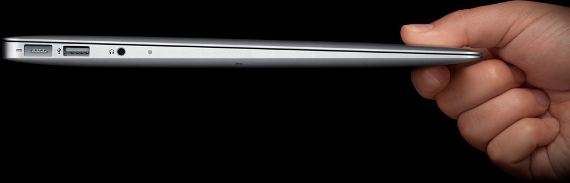

# apple.github.io
 1. 这是仿Apple网站图片特效web前端代码。
 2.用于营销方面的。
 <!DOCTYPE HTML PUBLIC "-//W3C//DTD HTML 4.0 Transitional//EN">
<html xmlns="http://www.w3.org/1999/xhtml">
<head>
<meta http-equiv="Content-Type" content="text/html; charset=utf-8" />
<title>Apple淡入淡出效果代码</title>

<LINK rel=stylesheet type=text/css href="css/apple.css">
</head>
<body style="text-align:center">

  

    
 <A class=block href="http://www.apple.com/" target="_blank">
      <H1></H1>
      

      </A> 

  

</body>
</html>

